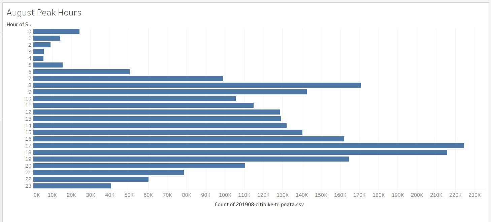

# bikesharing

## Overview
The purpose of this analysis is to prove to investors that a bike-sharing program in Des Moines is a solid business decision.

## Results
Analysis was performed on data from NYC bike trip data from the month of August 2019. Here are the results:

Data shows that the peak hours of use were after working hours, between 17:00-19:00. The third largest was in the 08:00 hour, before work starts. People are using before and after work hours.

Our analysis show that when a user checks out a bike, on avarage they are only using it for 10 minutes. There is a sharp decline from there, with a very small number keeping the bike for an hour and almost no one keeps the bike for two hours or more.

A majority of the users are male. About a quarter of the users are female.

We broke up the check out time by gender. Results were similar. Most of the users are returning the bike within the first hour (most within 30 minutes) and no gender keeps the bike two hours or more. 

This heatmap shows the trips by weekday per hour. The darker the spot the more trips. This graph shows during the workweek the peak hours are between 07:00-09:00 and 16:00-19:00. This corresponds with our analysis that users are checking out the bikes before and after work. We see the reverse on the weekends, peak hours are between 10:00-18:00. 

We broke down the heatmap above by gender. We see similar results. However, we see larger results with the male than the other genders.

This graph shows user trips broken down by weekday and by gender. Most of the users are subscribers and the trend follows here. The busier days are the weekdays: Monday, Tuesday, Thursday, and Friday. 
For the customers, they tend to use the bikes during the weekends. The busier days are Saturday and Sunday and the data is equal for all genders.

## Summary

We found that a bike-sharing program would be successful in the Des Moines area. The analysis shows that a bike-sharing program is popular with working individuals and sees high usage before and after working hours. These individuals are also not just one-time users, they are subscribers, meaning they are setting up an automatic recurring payment. The users are also only using the bikes short term (typically between 15-20 minutes). Since the bike is not used long term, we can get more users on the bike quickly. 

Additional suggested analysis:
- show the length of time a user has been a subscriber
- show the length of time a bike can run before it needs to be repaired
