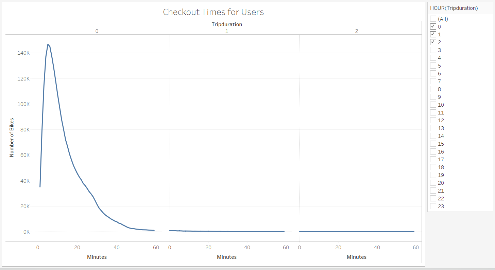
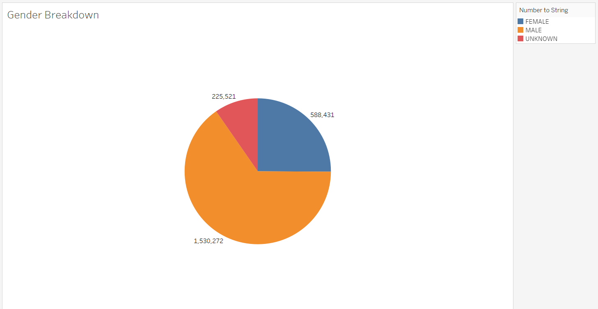
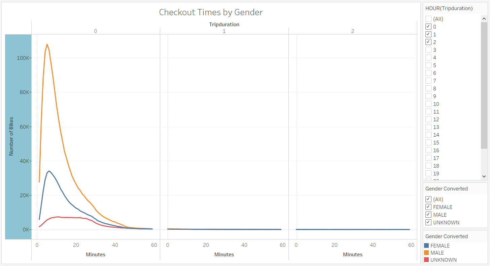
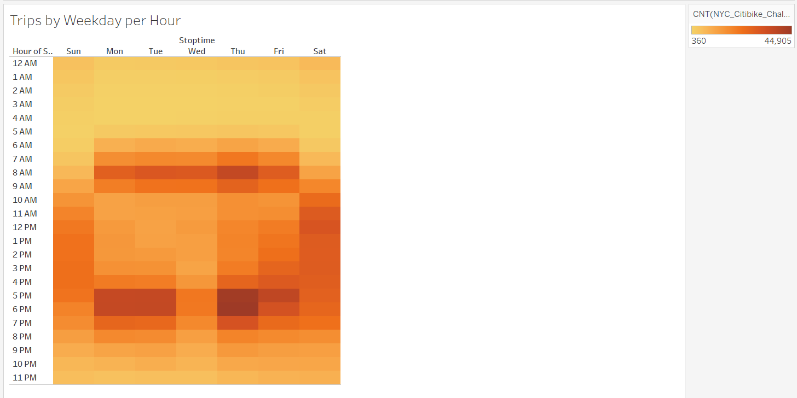
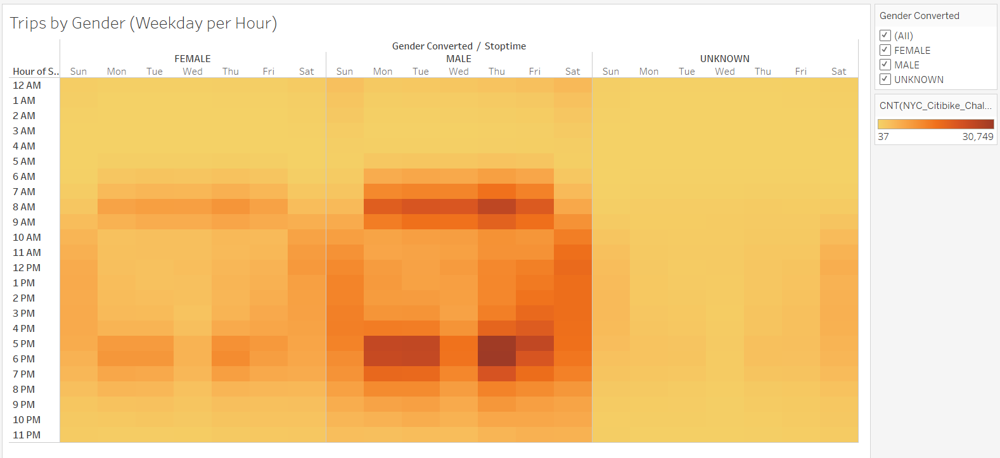
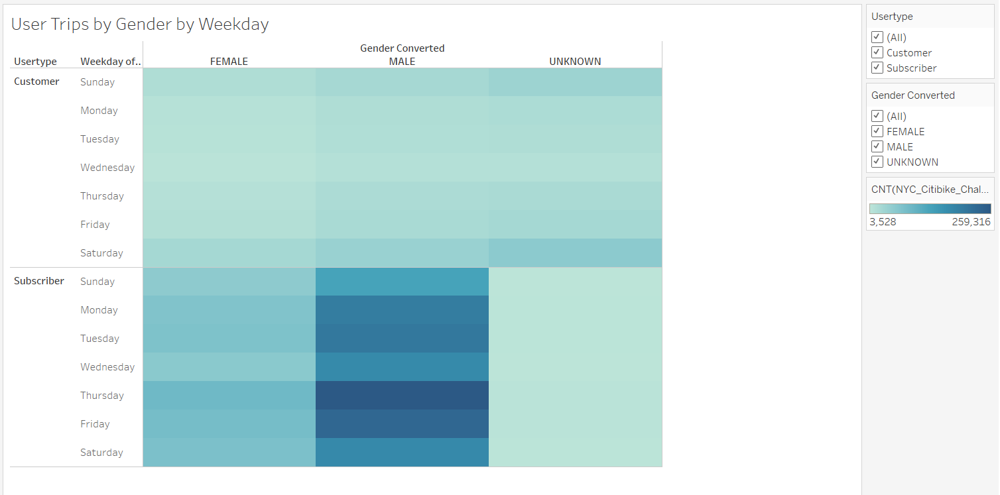

# bikesharing

## Overview
The purpose of this analysis is to prove to investors that a bike-sharing program in Des Moines is a solid business decision.

## Results
Analysis was performed on data from NYC bike trip data from the month of August 2019. Here are the results:

## Summary
